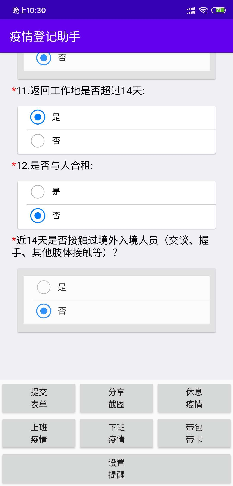

# PunchHelper
慧博云通疫情打卡辅助工具

- 【提交表单】(一键提交上面的问卷表单，第一次需要手动填写,下一次只需要点击"提交表单"按钮即可)
- 【分享截图】(分享问卷提交成功后的截图)
- 【休息疫情】(分享节假日用的疫情上报信息,自动填充时间并使用上次修改后的模板)
- 【上班疫情】(分享上班前用的疫情上班信息，自动填充时间并使用上次修改后的模板)
- 【下班疫情】(分享下班后用的疫情上班信息，自动填充时间并使用上次修改后的模板)
- 【带包带卡】(分享带包带卡提醒信息，自动使用上次修改后的模板)
- 【设置提醒】(可以设置上下班疫情上报提醒)

[安装包下载地址( 微信:请使用外部浏览器打开本页面 )](https://github.com/guangdeshishe/PunchHelper/releases/download/v1.0/PuncherHelper_v1.0_release_20200418-222117.apk)
 

